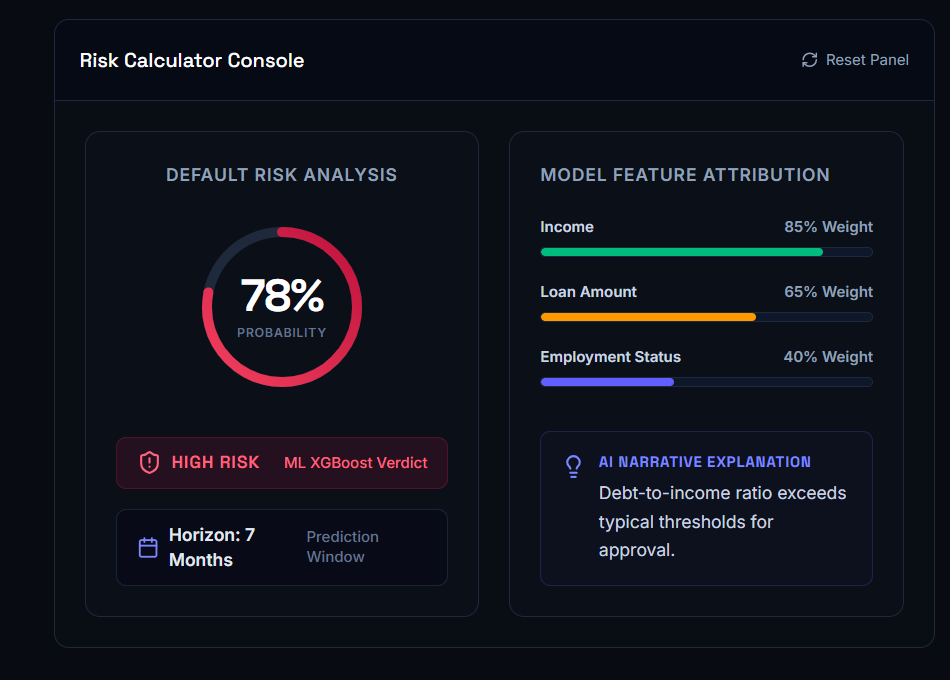
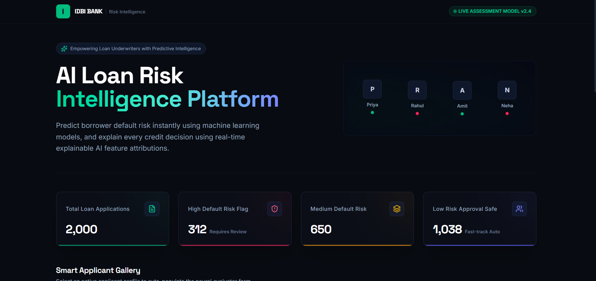
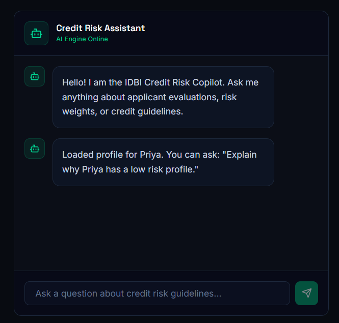

# 🏦 IDBI AI Loan Risk Intelligence Platform

> AI-powered Loan Default Prediction & Risk Intelligence System built for the **IDBI Bank Hackathon**.


---

# 📌 Overview

Financial institutions process thousands of loan applications every day. Traditional credit evaluation methods are often time-consuming, manually intensive, and may fail to identify subtle patterns indicating future defaults.

Our solution leverages **Machine Learning + Explainable AI + Modern Web Technologies** to build an intelligent loan risk assessment platform capable of:

- Predicting loan default probability
- Categorizing applicants into risk levels
- Explaining why a prediction was made
- Providing an AI-powered risk assistant
- Displaying portfolio-wide loan analytics
- Alerting risk officers about critical cases

The platform enables faster, data-driven, and more transparent loan decisions.

---

# 🚀 Features

## 🤖 AI Loan Risk Prediction

- Predicts probability of loan default
- Classifies applicant as:
  - 🟢 Low Risk
  - 🟡 Medium Risk
  - 🔴 High Risk
- Powered by XGBoost Machine Learning

---

## 📊 Smart Dashboard

Displays portfolio statistics including

- Total Loans
- High Risk Customers
- Medium Risk Customers
- Low Risk Customers

---

## 💬 AI Risk Assistant

Interactive chatbot capable of answering questions regarding applicant risk.

Example:

> Why is this applicant risky?

---

## 🧠 Explainable AI

Instead of simply predicting risk, the platform explains the major factors influencing the prediction.

Example:

- Income
- Loan Amount
- Employment Status

---

## 🚨 Portfolio Alerts

Generates alerts for applicants requiring manual verification.

---

# 🏗️ System Architecture

```
                +----------------------+
                |     React Frontend   |
                +----------+-----------+
                           |
                           |
                    REST API Calls
                           |
                           ▼
              +------------------------+
              |     FastAPI Backend    |
              +-----------+------------+
                          |
          +---------------+----------------+
          |                                |
          ▼                                ▼
   XGBoost ML Model                 Business Logic
   model.pkl                        Dashboard
                                    Chat
                                    Alerts
                                    Explain
```

---

# 🧠 Machine Learning Pipeline

```
Dataset

↓

Data Cleaning

↓

Feature Engineering

↓

Label Encoding

↓

Train-Test Split

↓

XGBoost Classifier

↓

Model Evaluation

↓

72.5% Accuracy

↓

Export model.pkl
```

---

# 🛠️ Tech Stack

## Frontend

- React
- Vite
- Tailwind CSS
- Framer Motion
- Axios

---

## Backend

- FastAPI
- Uvicorn
- Pydantic

---

## Machine Learning

- Python
- XGBoost
- Scikit-Learn
- Pandas
- Joblib

---

## Development Tools

- Google Colab
- VS Code
- Git
- GitHub

---

# 📂 Project Structure

```
IDBI-AI-Risk/

│
├── backend/
│   ├── app.py
│   ├── model.pkl
│   ├── label_encoder.pkl
│   ├── requirements.txt
│
├── frontend/
│   ├── src/
│   ├── public/
│   ├── package.json
│
├── README.md
```

---

# ⚙️ Installation

## Clone Repository

```bash
git clone https://github.com/yourusername/idbi-ai-risk.git

cd idbi-ai-risk
```

---

# Backend Setup

Navigate to backend

```bash
cd backend
```

Create Virtual Environment

Windows

```bash
python -m venv venv
```

Activate

```bash
venv\Scripts\activate
```

Install dependencies

```bash
pip install -r requirements.txt
```

Run FastAPI

```bash
uvicorn app:app --reload
```

Backend runs on

```
http://127.0.0.1:8000
```

Swagger Documentation

```
http://127.0.0.1:8000/docs
```

---

# Frontend Setup

Navigate to frontend

```bash
cd frontend
```

Install packages

```bash
npm install
```

Run

```bash
npm run dev
```

Frontend

```
http://localhost:5173
```

---

# API Endpoints

## Predict Loan Risk

POST

```
/predict
```

Request

```json
{
  "income": 9000,
  "loan_amount": 25000,
  "employment_status": "Employed"
}
```

Response

```json
{
  "probability": 0.29,
  "risk": "LOW",
  "months": 7
}
```


---

## Dashboard

GET

```
/dashboard
```


---

## AI Chat

POST

```
/chat
```


---

## Explain Prediction

GET

```
/explain
```

---

## Alerts

GET

```
/alerts
```

---

# Model Performance

| Metric | Value |
|---------|-------|
| Algorithm | XGBoost |
| Accuracy | **72.5%** |
| Features | Income, Loan Amount, Employment Status |

---

# Why XGBoost?

XGBoost was selected because it offers:

- High prediction accuracy
- Handles tabular banking data efficiently
- Fast inference
- Robust performance with structured datasets
- Widely used in financial risk modelling

---

# Future Enhancements

- SHAP Explainability
- Credit Score Integration
- Bank Statement Analysis
- OCR Document Verification
- Aadhaar/PAN Verification
- Real-time Fraud Detection
- Loan Recommendation Engine
- Customer Credit History Analysis
- Admin Analytics Dashboard
- Cloud Deployment
- Docker Support
- JWT Authentication
- PostgreSQL Database Integration

---

# Team Contributions

| Member | Contribution |
|---------|--------------|
| You | Machine Learning, FastAPI Backend, API Development, Model Integration |
| Team Member 1 | React Frontend |
| Team Member 2 | UI/UX |
| Team Member 3 | Presentation & Testing |

---

# Impact

Our solution enables banks to

- Reduce loan defaults
- Speed up loan approvals
- Increase transparency
- Improve decision making
- Reduce manual effort
- Enhance customer experience

---

# Built For

🏆 **IDBI Bank Hackathon**

*"Empowering smarter lending decisions through Artificial Intelligence."*

---


## ⭐ If you found this project useful, consider giving it a star!